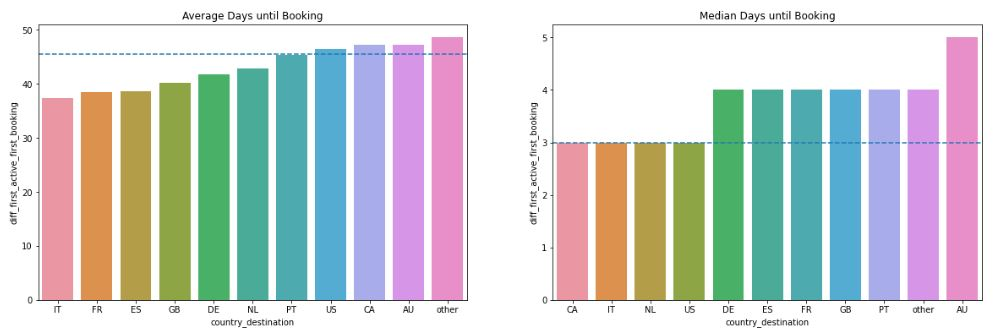
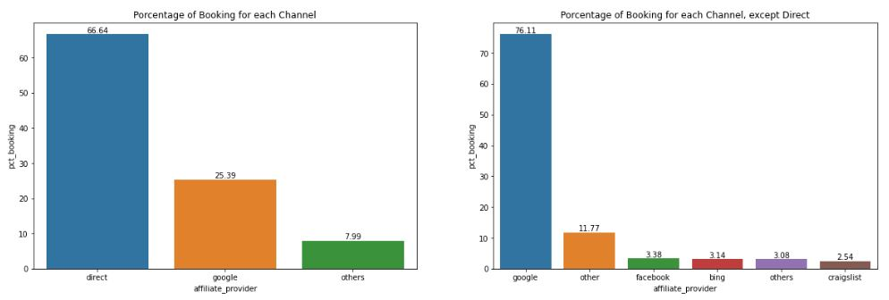
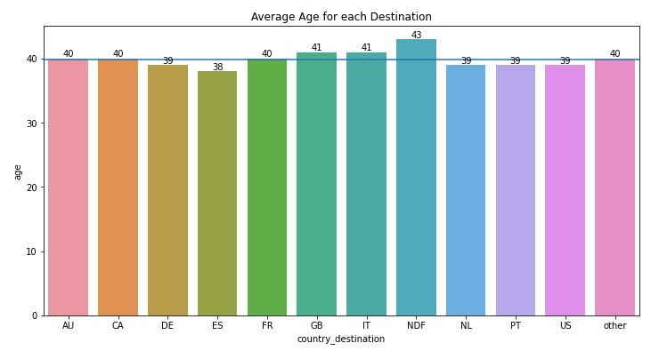

# Airbnb-First-Booking-Forecast

This repos contain all files from Airbnb first booking forecast 

## 1.0. Business Problem

Airbnb is an American company that operates an online marketplace for lodging to tourism activities. Airbnb does not own 
any of the listed properties, instead, it profits by receiving commission from each booking. 

New users on Airbnb can book a place across over 190 countries. By accurately predicting where a new user will book their
first travel experience, Airbnb can share more personalized content with their community, decrease the average time to 
first booking, and better forecast demand. 

For this project, company provide a dataset of users from the USA and are asked to predict which country a new user's
first booking destination will be. There are 12 possible outcomes of the destination country: 'US', 'FR', 'CA', 'GB', 
'IT', 'PT', 'NL', 'DE', 'AU', 'NDF' (no destination found) and 'others'.

## 2.0. Business Assumptions

For this project a few assumptions were made to solve the problem:
- Due to the granularity desired for the prediction, the session dataset will not be considered.
- The date of first booking will be considered as known and will be kept in the training dataset. 
- A user can choose only one country destination.
- Users older than 100 will not be considered.

## 3.0. Solution Strategy

This project was developed based on the CRISP-DS (Cross-Industry Standard Process - Data Science, a.k.a. CRISP-DM) 
project management method, adapted to the project at hand by following these steps:

- **Business Understanding:** Determine business objectives, key assumptions and project plan. 
- **Data Understanding:** Collect initial data, describe and explore data and verify data quality.
- **Data Preparation:** Format and clean dataset, feature engineering and selection.
- **Modeling:** Select and build models, choose performance metrics and model assessment. 
- **Evaluation:** Evaluate results, review process and determine next steps.
- **Deployment:** Produce final report and review project.

## 4.0. Main Data Insights

Through exploratory data analysis done on data collected in a single day, the main insights can be seen below:

Through exploratory data analysis done on the data users to understand better the dataset and generate a few insights 
show bellow:

Através da analise exploratória dos dados feita sobre os dados do usuário gerou alguns insights através da validação das 
hipoteses atra´ves da analise bivariada. Todas hipoteses e o resultado da validação pode ser visto mais detalhamente nos
notebooks, abaixo mostramos os 3 principais insights revelados pela EDA.

**H1: Across all destinations, it takes users 3 days (median) to make their first Airbnb booking since their first 
activation.**

**H5: The Google Marketing channel accounts for more than 40% of bookings to countries outside the USA.**

**H7: Average age for all destinations is 40 years old.**

## 5.0. Machine Learning Model

## 6.0. Machine Learning Model Performance

## 7.0. Business Results

## 8.0. Conclusions

## 9.0. Lessons Learned

## 10.0. Next Steps to Improve